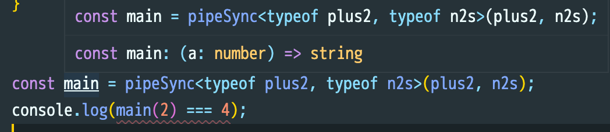

# @lidqqq/pipe

A type safety function to create a pipeline

## Installation

```
npm i @lidqqq/pipe
```

## Usage

### TypeScript

```typescript
// Async
import { pipe } from '@lidqqq/pipe';

async function plus2(n: number): Promise<number> {
  return n + 2;
}
async function n2s(n: number): Promise<string> {
  return n.toString();
}

const main = pipe<typeof plus2, typeof n2s>(plus2, n2s);

(async () => {
  console.log((await main(2)) === '4'); // true
})();
```

```typescript
// Synchronously
import { pipeSync } from '@lidqqq/pipe';

function plus2(a: number) {
  return a + 2;
}
function n2s(a: number): string {
  return a.toString();
}

const main = pipeSync<typeof plus2, typeof n2s>(plus2, n2s);
console.log(main(42) === '44'); // true
```

### JavaScript

```js
// ESM
import { pipe } from '@lidqqq/pipe';
// CJS
const { pipe } = require('@lidqqq/pipe');
```

## Type safety


